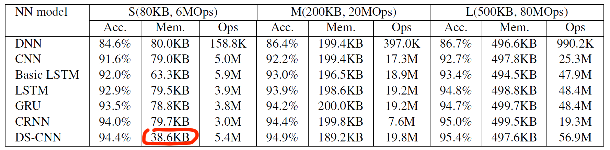
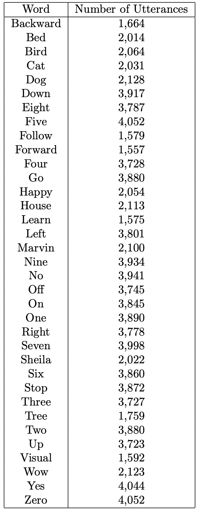

# Depthwise Separable Convolutional Neural Net ASIC for Keyword Spotting

This project is a submission to the [4th ChipIgnite AI competition](https://efabless.com/genai/challenges/4)
The challenge aims to leverage generative AI to develop an open-source hardware accelerator designed explicitly for Keyword Spotting (KWS) applications on the Caravel System-on-Chip.

## What is Keyword Spotting (KWS)

[Keyword Spotting (KWS)](https://en.wikipedia.org/wiki/Keyword_spotting) (or more simply, word spotting) deals with the identification of predefined keywords in audio data streams.

## Inspiration
This project is inpsired by the low-power neural network solutions proposed in the following papers:
   * [Hello Edge: Keyword Spotting on Microcontrollers](https://arxiv.org/abs/1711.07128)
   * [Streaming keyword spotting on mobile devices](https://arxiv.org/abs/2005.06720)

## High-level Architecture and Design
1. [Depthwise separable convolutional](https://paperswithcode.com/method/depthwise-separable-convolution) neural network (DS-CNN).
2. Reduced precision to store neural network weights, we will experiment with INT8, [FP8](https://arxiv.org/abs/2209.05433), FP4 and [Ternary formats](https://arxiv.org/pdf/2402.17764.pdf).
3. Reduced precision to represent activation values, most likely INT8 or FP8.
4. Aim to fit neural network parameters (weights) into 16Kb .. 32Kb of memory.

## Neural Network primitives necessary
* 2D convolution layer
* 2D depthwise layer
* Batch Normalization layer
* Fully connected layer
* ReLU activation

## Training & Test Data

Pete Warden. [Speech commands: A public dataset for single-word speech recognition.](http://arxiv.org/abs/1804.03209)
Dataset available from: http://download.tensorflow.org/data/speech_commands_v0.01.tar.gz

## Useful Links
* https://paperswithcode.com/task/keyword-spotting
* https://paperswithcode.com/paper/hello-edge-keyword-spotting-on
* https://github.com/ARM-software/ML-KWS-for-MCU
* https://github.com/google-research/google-research/tree/master/kws_streaming
* https://research.google/pubs/keyword-spotting-for-google-assistant-using-contextual-speech-recognition

# Based on Caravel User Project template

  

| :exclamation: Important Note            |
|-----------------------------------------|

## Please fill in your project documentation in this README.md file 

Refer to [README](docs/source/index.rst#section-quickstart) for a quickstart of how to use caravel_user_project

Refer to [README](docs/source/index.rst) for this sample project documentation. 

Refer to the following [readthedocs](https://caravel-sim-infrastructure.readthedocs.io/en/latest/index.html) for how to add cocotb tests to your project. 
